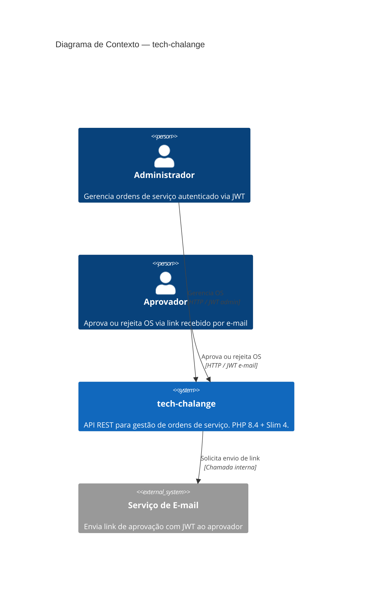
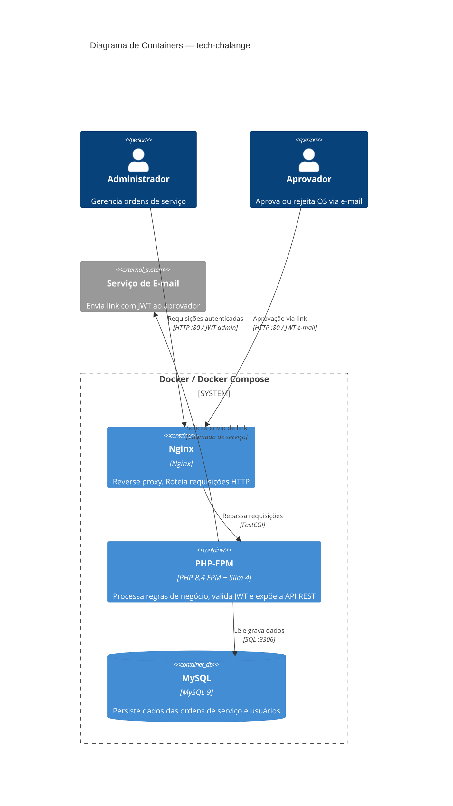
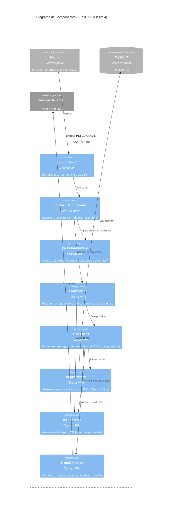
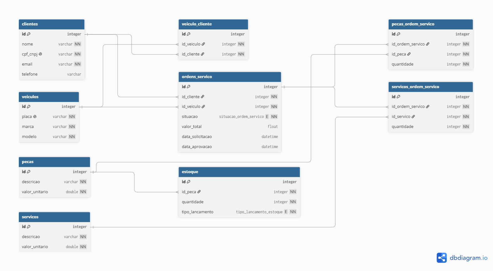

# Design Approval Sheet (DAS)

### Projeto: Sistema integrado de atendimento e execuçāo de serviço
**Data:** 10/05/2026
| Revisor | Status |
|------------|------------|
| Augusto Bortoncello | Pendente |
| Claudio Kosooski | Pendente |
| Daniel Alferes | Pendente |
| Fernando Oliveira | Aprovado |
| Oeslei Kuhn | Pendente |

---

### Contexto do projeto
Atualmente, o processo de atendimento em oficinas mecânicas é realizado de forma descentralizada, utilizando anotações em papel e planilhas eletrônicas para controlar o diagnóstico, a execução dos serviços e a entrega dos veículos. Esse modelo dificulta a gestão das informações e compromete a eficiência operacional da oficina.

Como consequência, são observados diversos problemas, entre eles:

- Erros na priorização dos atendimentos.
- Falhas no controle de pecas e insumos.
- Dificuldade em acompanhar o status dos serviços.
- Perda de histórico de clientes e veículos.
- Ineficiência no fluxo de orçamentos e autorizações.

Diante desse cenário, a oficina decidiu investir no desenvolvimento de um sistema integrado de atendimento e gestão de serviços mecânicos. A solução permitirá centralizar todas as etapas do processo, desde o diagnóstico até a entrega do veículo, proporcionando maior organização e controle das operações. Além disso, os clientes poderão receber e aprovar orçamentos e acompanhar, em tempo real, o andamento dos serviços, tornando o atendimento mais ágil, transparente e seguro.

---

### Requisitos do sistema
#### Requisitos funcionais

- **RF01 — Cadastrar Cliente**
Permitir o cadastro, consulta, atualização e remoção de clientes (CRUD), identificados de forma única por CPF (pessoa física) ou CNPJ (pessoa jurídica). Os dados cadastrais incluem nome, contato e endereço.

- **RF02 — Cadastrar Veículo**
Permitir o cadastro, consulta, atualização e remoção de veículos (CRUD), identificados pela placa. Os dados incluem marca, modelo, ano e associação ao cliente proprietário.

- **RF03 — Criar Ordem de Serviço**
Permitir a abertura de uma nova Ordem de Serviço (OS), vinculando obrigatoriamente um cliente (identificado por CPF/CNPJ) e um veículo (identificado pela placa). A OS criada inicia com o status *Recebida*.

- **RF04 — Adicionar Serviços, Peças e Insumos à OS**
Permitir a inclusão de serviços, peças e insumos à OS durante sua criação ou em etapas posteriores do fluxo, desde que o status da OS permita alterações.

- **RF05 — Gerar Orçamento Automaticamente**
Calcular e gerar automaticamente o orçamento da OS com base nos serviços cadastrados (mão de obra) e nas peças/insumos vinculados (custo de materiais).

- **RF06 — Registrar Adicionais Identificados no Diagnóstico**
Permitir ao mecânico incluir serviços e peças adicionais identificados durante a etapa de diagnóstico do veículo, atualizando o escopo da OS.

- **RF07 — Gerar Orçamento Adicional Pós-Diagnóstico**
Após o registro de itens adicionais no diagnóstico, gerar automaticamente um novo orçamento complementar para aprovação do cliente.

- **RF08 — Enviar Orçamento ao Cliente por E-mail**
Após a conclusão do diagnóstico, enviar o orçamento ao cliente por e-mail, contendo um link para que ele possa aprovar ou rejeitar os serviços propostos.

- **RF09 — Aprovar ou Rejeitar Orçamento pelo Cliente**
Permitir que o cliente aprove ou rejeite o orçamento recebido por e-mail. A aprovação avança a OS para *Em Execução*; a rejeição encerra o fluxo com status correspondente.

- **RF10 — Registrar Adicionais Identificados Durante a Execução**
Permitir ao mecânico incluir serviços ou peças adicionais que sejam identificados durante a execução do trabalho, gerando novo ciclo de orçamento e aprovação se necessário.

- **RF11 — Finalizar Ordem de Serviço**
Permitir que o responsável marque a OS como *Finalizada* após a conclusão de todos os serviços, sinalizando que o veículo está pronto para retirada.

- **RF12 — Notificar Cliente por E-mail ao Finalizar OS**
Enviar automaticamente uma notificação por e-mail ao cliente quando a OS for marcada como *Finalizada*, informando que o veículo está disponível para retirada.

- **RF13 — Registrar Entrega do Veículo**
Permitir que o responsável marque a OS como *Entregue* no momento em que o veículo for devolvido ao cliente, encerrando o ciclo da OS.

- **RF14 — Consultar Detalhes de uma OS**
Permitir a consulta completa dos dados de uma Ordem de Serviço, incluindo cliente, veículo, serviços, peças, histórico de status e valores.

- **RF15 — Listar e Filtrar Ordens de Serviço**
Permitir a listagem de OSs com filtros por status, cliente ou veículo, facilitando o acompanhamento operacional da oficina.

- **RF16 — Consultar Andamento da OS pelo Cliente (API Pública)**
Disponibilizar um endpoint público que permita ao cliente acompanhar o status atual da sua OS mais recente, mediante identificação por CPF/CNPJ e placa do veículo, sem necessidade de autenticação administrativa.

- **RF17 — Priorizar OS na Fila de Atendimento**
Permitir a definição de prioridade entre as Ordens de Serviço pendentes, ordenando a fila de atendimento da oficina de acordo com critérios operacionais.

- **RF18 — Cadastrar Serviços**
Permitir o cadastro, consulta, atualização e remoção de serviços oferecidos pela oficina (CRUD), incluindo descrição, tempo estimado de execução e valor da mão de obra.

- **RF19 — Cadastrar Peças e Insumos**
Permitir o cadastro, consulta, atualização e remoção de peças e insumos (CRUD), incluindo descrição, unidade de medida e valor unitário.

- **RF20 — Registrar Entradas no Estoque**
Permitir o lançamento de entradas de peças e insumos no estoque, atualizando as quantidades disponíveis.

- **RF21 — Registrar Baixas no Estoque**
Registrar automaticamente a baixa de peças e insumos no estoque quando vinculados à execução de uma OS.

- **RF22 — Consultar Disponibilidade de Estoque**
Permitir a consulta da quantidade disponível de peças e insumos em estoque, sinalizando itens com baixo nível de disponibilidade.

- **RF23 — Consultar Tempo Médio de Execução dos Serviços**
Disponibilizar um indicador operacional com o tempo médio de execução por tipo de serviço, calculado com base no histórico de OSs finalizadas.

#### Requisitos não funcionais

- **RNF01 — Autenticação JWT nas APIs Administrativas**
Todas as rotas administrativas devem exigir autenticação via token JWT, garantindo que apenas usuários autorizados possam executar operações de escrita e gestão.

- **RNF02 — Autenticação JWT no Fluxo de Aprovação por E-mail**
O link de aprovação/rejeição de orçamento enviado ao cliente deve conter um token JWT de uso único e tempo limitado, garantindo que apenas o destinatário possa executar a ação.

- **RNF03 — Validação de CPF/CNPJ**
O sistema deve validar o formato e os dígitos verificadores de CPF e CNPJ antes de persistir ou processar qualquer dado associado a um cliente.

- **RNF04 — Validação de Placa de Veículo**
O sistema deve validar o formato da placa do veículo (padrão Mercosul e padrão antigo brasileiro) antes de aceitar o cadastro ou vínculo com uma OS.

- **RNF05 — Mascaramento de CPF/CNPJ na Visualização**
Na exibição dos dados da OS (inclusive na API pública), o CPF/CNPJ do cliente deve ser exibido de forma mascarada (ex: `123.***.***-01` e `12.***.***/0001-12`), preservando a privacidade do titular.

- **RNF06 — Rastreabilidade das Mudanças de Status da OS**
Toda transição de status de uma OS deve ser registrada com data, hora e responsável pela ação, garantindo auditabilidade completa do ciclo de vida da OS.

- **RNF07 — Cobertura Mínima de Testes Automatizados**
Os domínios críticos do sistema (OS, clientes, veículos, estoque) devem possuir cobertura mínima de 80% por testes automatizados.

- **RNF08 — Testes Unitários e de Integração**
Os principais fluxos do sistema devem ser cobertos por testes unitários (regras de negócio isoladas) e testes de integração (fluxos end-to-end entre camadas).

- **RNF09 — Arquitetura Monolítica em Camadas**
O sistema deve seguir uma arquitetura monolítica organizada em camadas (apresentação, aplicação, domínio e infraestrutura), aplicando os princípios de DDD.

- **RNF10 — APIs REST Documentadas via Swagger/OpenAPI**
Todos os endpoints devem ser documentados via Swagger (OpenAPI 3.x), com descrição de parâmetros, payloads, respostas e exemplos.

- **RNF11 — Dockerfile para Build da Aplicação**
A aplicação deve conter um `Dockerfile` válido que permita a construção da imagem de forma reproduzível e independente de ambiente local.

- **RNF12 — docker-compose para Execução do Ambiente**
Disponibilizar um arquivo `docker-compose.yml` que orquestre todos os serviços necessários para execução local (aplicação, banco de dados, etc.).

- **RNF13 — Banco de Dados com Justificativa Documentada**
A escolha do banco de dados é livre, mas deve ser documentada no README com justificativa técnica que considere os requisitos do sistema.

- **RNF14 — Envio de E-mails para Clientes**
O sistema deve ser capaz de enviar e-mails transacionais aos clientes (orçamento para aprovação e notificação de finalização), utilizando um serviço de e-mail configurável por variável de ambiente.

- **RNF15 — Repositório Privado com Acesso Configurado**
O código-fonte deve estar em repositório privado com acesso concedido ao usuário `soatarchitecture`.

- **RNF16 — README com Instruções de Execução**
O repositório deve conter um `README.md` com instruções claras de como configurar e executar o ambiente localmente, incluindo pré-requisitos e variáveis de ambiente necessárias.

- **RNF17 — Documentação DDD Completa**
Deve ser entregue documentação DDD (no Miro ou equivalente) contendo Event Storming completo dos fluxos de OS e gestão de peças, diagramas conforme apresentado na disciplina e linguagem ubíqua aplicada.

- **RNF18 — Relatório de Análise de Vulnerabilidades**
Deve ser gerado e entregue um relatório com os resultados do scan de vulnerabilidades realizado sobre o código-fonte da aplicação.

---

### Arquitetura e tecnologias

| Componente          | Tecnologia                         |
|---------------------|------------------------------------|
| Linguagem           | PHP 8.4                            |
| Framework Web       | Slim Framework 4.x                 |
| Validação           | Symfony Validator                  |
| Banco de Dados      | MySQL 9                            |
| Servidor Web        | Nginx Alpine (latest)              |
| Infraestrutura      | Docker / Docker Compose            |
| Autenticação        | JWT (lcobucci/jwt)             |
| Testes              | PHPUnit                            |
| Análise de Código   | SonarCloud                         |
| CI/CD               | GitHub Actions                     |
| E-mail              | PHPMailer (SMTP)                   |
| Segurança (DAST)    | OWASP ZAP                          |

---

### Architecture Decision Record (ADR)
- **MySQL:** [ADR-001](../adr/001-banco-dados.md)
- **Symfony Validator:** [ADR-002](../adr/002-symfony-validator.md)
- **Slim:** [ADR-003](../adr/003-framework-slim.md)

---

### Estrutura da arquitetura
#### C1 — Diagrama de Contexto

#### C2 — Diagrama de Containers

#### C3 — Diagrama de Componentes (PHP-FPM / Slim 4)

---

### Diagrama de implantação e configuração

---

### Modelo de dados
#### Diagrama de entidade-relacionamento (DER)

---

### Documentação da API
#### Swagger
- [Open API](../../public/openapi.json)

---

### Plano de testes e monitoramento
#### PHPUnit
Testes unitários e de integração executados automaticamente pelo pipeline de CI/CD a cada commit via GitHub Actions. A cobertura de código é reportada ao SonarCloud para acompanhamento contínuo.
#### SonarQube
Análise estática contínua do código-fonte, atuando como Quality Gate automatizado. Monitora:

Bugs e vulnerabilidades de segurança (security hotspots)
Code smells e duplicações de código
Cobertura de testes (integrada ao PHPUnit)
Métricas de manutenibilidade e débito técnico

O pipeline bloqueia o merge caso o Quality Gate falhe, garantindo que apenas código dentro dos padrões de qualidade definidos chegue à branch principal.
#### OWASP ZAP
Varredura de segurança dinâmica (DAST) executada em modo passivo via container Docker, seguindo as diretrizes do OWASP Top 10. Integrada ao pipeline de CI/CD, analisa a superfície de ataque da API em execução. Complementa os controles estáticos do SonarCloud com uma perspectiva de segurança em tempo de execução.

