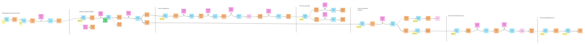
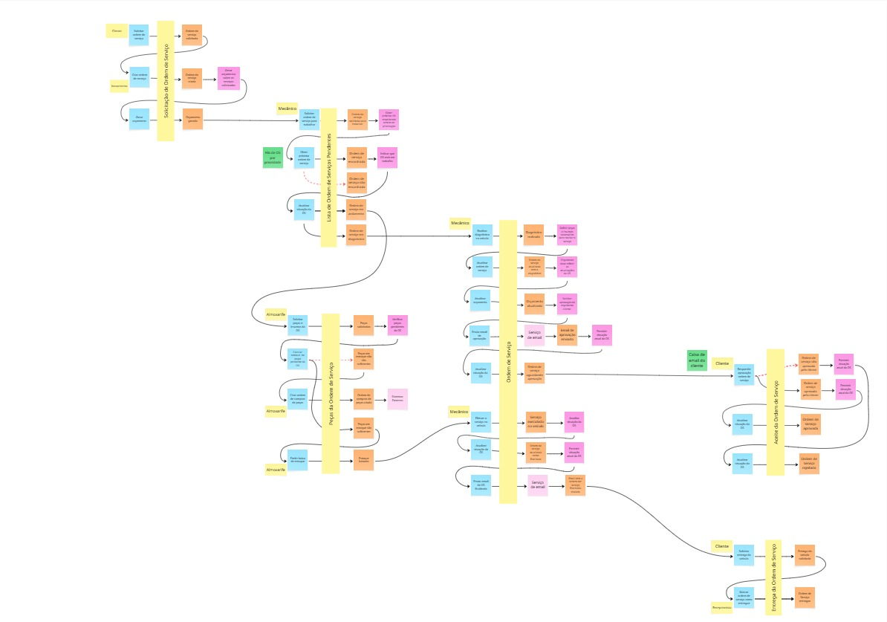
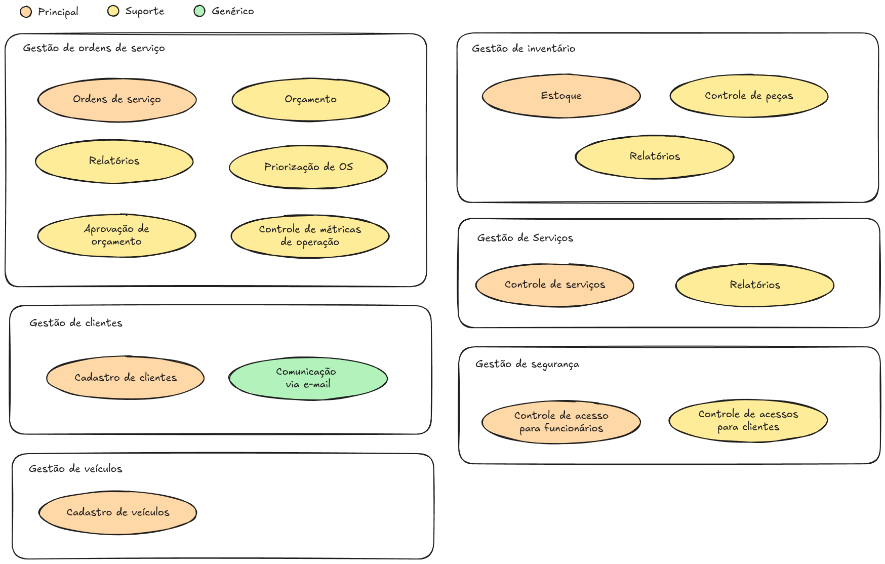
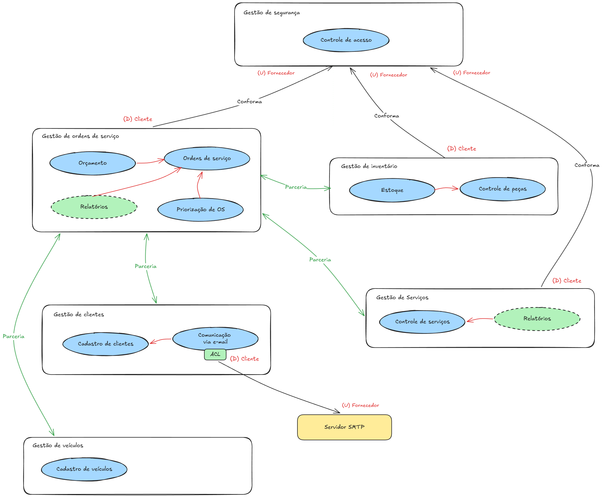

# Documentação DDD — Oficina Mecânica

Artefatos produzidos durante a fase de modelagem do domínio,
seguindo os princípios de Domain-Driven Design (DDD).

---

## Domain Storytelling

Narrativa dos fluxos de atendimento da oficina, mapeando atores,
atividades e objetos de trabalho em três fluxos principais.

### Fluxo do Cliente

> Arquivo fonte: [domain-storytelling-cliente.egn](./domain-storytelling-cliente.egn)  
> *(Abrir com [egon.io](https://egon.io))*

### Fluxo da Ordem de Serviço

> Arquivo fonte: [domain-storytelling-ordem-servico.egn](./domain-storytelling-ordem-servico.egn)  
> *(Abrir com [egon.io](https://egon.io))*

### Fluxo do Controle de Estoque

> Arquivo fonte: [domain-storytelling-estoque.egn](./domain-storytelling-estoque.egn)  
> *(Abrir com [egon.io](https://egon.io))*

---

## Event Storming

Mapeamento dos eventos de domínio, comandos, agregados e
políticas nos principais fluxos do sistema.

### Linhas do Tempo

### Contextos Delimitados

> Board completo no Miro:
> [Abrir no Miro](https://miro.com/app/board/uXjVHaErvBw=/)

---

## Domínios e Linguagem Ubíqua

Classificação dos subdomínios (Principal, Suporte, Genérico).

> Board no Excalidraw:
> [Abrir no Excalidraw](https://excalidraw.com/#room=61a5deb68a5644639fe3,-UGs5VigxN_metUxdaeihg)

---

### Linguagem Ubíqua

#### Domínio de Gestão de Ordens de Serviço

**Subdomínio Principal: Ordens de Serviço**

| Termo | Definição |
|---|---|
| Ordem de Serviço (OS) | Documento central que registra todos os dados de um atendimento: cliente, veículo, serviços, peças, status e histórico |
| Abertura de OS | Ato de criar uma nova OS, vinculando cliente e veículo identificados |
| Status da OS | Fase atual da OS: `Recebida`, `Em Diagnóstico`, `Aguardando Aprovação`, `Aprovada`, `Rejeitada`, `Em Execução`, `Finalizada`, `Entregue` |
| Responsável pela OS | Funcionário (recepcionista, mecânico ou gerente) que está conduzindo a OS no momento |
| Veículo | Bem do cliente vinculado à OS, identificado pela placa |
| Encerramento da OS | Transição do status para `Finalizada` após conclusão dos serviços |
| Entrega | Ato de devolver o veículo ao cliente, transitando a OS para `Entregue` |

**Subdomínio de Suporte: Orçamento**

| Termo | Definição |
|---|---|
| Orçamento | Documento financeiro gerado automaticamente a partir dos serviços e peças vinculados à OS |
| Valor de Mão de Obra | Custo calculado com base nos serviços incluídos na OS |
| Valor de Peças | Custo calculado com base nas peças e insumos reservados para a OS |
| Valor Total | Soma do valor de mão de obra e valor de peças |
| Emissão do Orçamento | Ato de enviar o orçamento ao cliente para aprovação |

**Subdomínio de Suporte: Controle de Aprovação**

| Termo | Definição |
|---|---|
| Aprovação | Confirmação do cliente de que autoriza a execução dos serviços e peças descritos no orçamento |
| Rejeição | Recusa do cliente ao orçamento, impedindo a execução dos serviços |
| Aprovação Parcial | Autorização do cliente para apenas parte dos serviços ou peças orçados |

**Subdomínio de Suporte: Priorização de OS**

| Termo | Definição |
|---|---|
| Fila de Atendimento | Lista ordenada de OSs aguardando execução |
| Tempo de Espera | Tempo decorrido desde a abertura da OS até o início da execução |

**Subdomínio de Suporte: Relatórios (OS)**

| Termo | Definição |
|---|---|
| Tempo Médio de Execução | Média de tempo entre o início e o encerramento das OSs, por tipo de serviço |
| OSs em Aberto | Listagem de todas as OSs que ainda não atingiram o status `Entregue` |

---

#### Domínio de Gestão de Inventário

**Subdomínio Principal: Estoque**

| Termo | Definição |
|---|---|
| Peça | Item físico utilizado na execução de serviços (ex: filtro de óleo, pastilha de freio) |
| Insumo | Material consumível utilizado nos serviços (ex: óleo, fluido de freio) |
| Quantidade em Estoque | Número de unidades disponíveis de uma peça ou insumo |
| Baixa de Estoque | Redução da quantidade em estoque quando uma peça é consumida em uma OS |
| Entrada de Estoque | Incremento da quantidade em estoque quando uma peça é adicionada ao inventário |
| Peça Disponível | Item em estoque que ainda não foi reservado |
| Almoxarife | Funcionário responsável pela gestão física do estoque |

**Subdomínio de Suporte: Controle de Peças**

| Termo | Definição |
|---|---|
| Peça | Item físico utilizado na execução de serviços (ex: filtro de óleo, pastilha de freio). |

---

#### Domínio de Gestão de Serviços

**Subdomínio Principal: Controle de Serviços**

| Termo | Definição |
|---|---|
| Serviço | Atividade de manutenção ou reparo cadastrada no sistema (ex: troca de óleo, alinhamento) |
| Tempo Estimado | Duração prevista para execução de um serviço |
| Preço de Mão de Obra | Valor cobrado pela execução de um serviço específico |
| Execução de Serviço | Realização efetiva do serviço por um mecânico dentro de uma OS |
| Serviço Adicional | Serviço identificado durante o diagnóstico que requer nova aprovação |

**Subdomínio de Suporte: Relatórios (Serviços)**

| Termo | Definição |
|---|---|
| Tempo Médio por Serviço | Média de tempo real gasto na execução de cada tipo de serviço |
| Serviços Mais Executados | Ranking dos serviços com maior frequência de execução no período |

---

#### Domínio de Gestão de Clientes

**Subdomínio Principal: Cadastro de Clientes**

| Termo | Definição |
|---|---|
| Cliente | Pessoa física (CPF) ou jurídica (CNPJ) que possui ou já possuiu uma OS na oficina |
| Identificação do Cliente | CPF ou CNPJ utilizado para localizar ou cadastrar um cliente no sistema |
| Histórico do Cliente | Registro de todas as OSs anteriores vinculadas ao cliente |
| Veículo do Cliente | Veículo(s) cadastrado(s) em nome do cliente |

**Subdomínio Genérico: Comunicação via E-mail**

| Termo | Definição |
|---|---|
| Notificação | Mensagem enviada ao cliente informando eventos relevantes da OS |
| Envio de Orçamento | Comunicação que entrega o orçamento ao cliente para aprovação |
| Email de Finalização da OS | Comunicação que notifica o cliente quando o serviço é concluído |

---

#### Domínio de Gestão de Segurança

**Subdomínio Principal: Controle de Acesso para Funcionários**

| Termo | Definição |
|---|---|
| Funcionário | Usuário interno do sistema |
| Autenticação | Processo de verificação de identidade via credenciais (JWT) |
| Token de Acesso | Credencial temporária gerada após autenticação bem-sucedida |
| Permissão | Autorização para executar uma ação específica no sistema |

**Subdomínio de Suporte: Controle de Acesso para Clientes**

| Termo | Definição |
|---|---|
| Consulta Pública de OS | Acesso do cliente ao status da OS via API, sem autenticação administrativa |
| Token para Aprovação de Orçamento | Token temporário enviado no e-mail para aprovação do orçamento |
| Chave de Consulta | Identificador (ex: número da OS + CPF/CNPJ) que o cliente usa para acessar sua OS |

---

## Contextos Delimitados (Bounded Contexts)

Mapa de contextos com os padrões de integração entre domínios
(ACL, OHS, Conformist).

### Mapa de Contexto

### Diagrama de Contextos Delimitados

> Board no Excalidraw:
> [Abrir no Excalidraw](https://miro.com/app/board/uXjVHaErvBw=/)